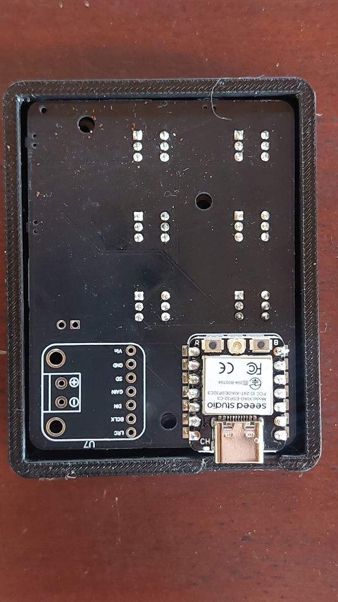
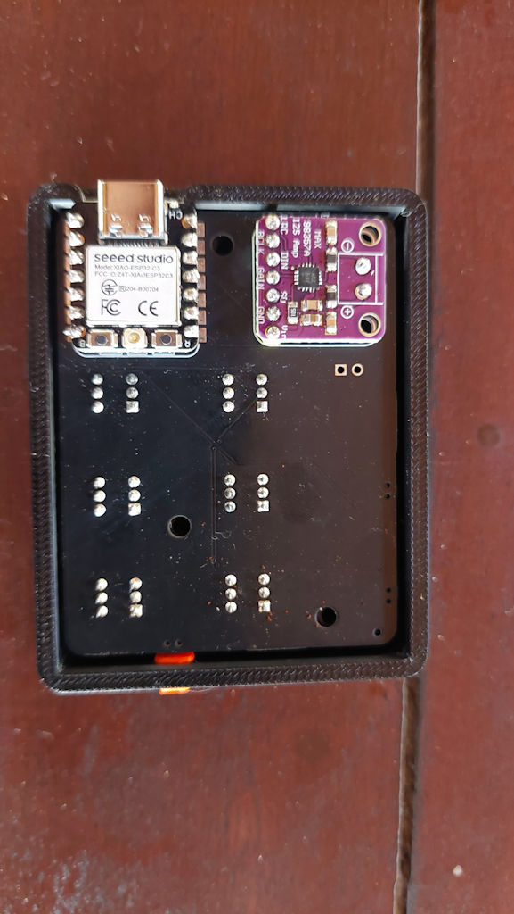
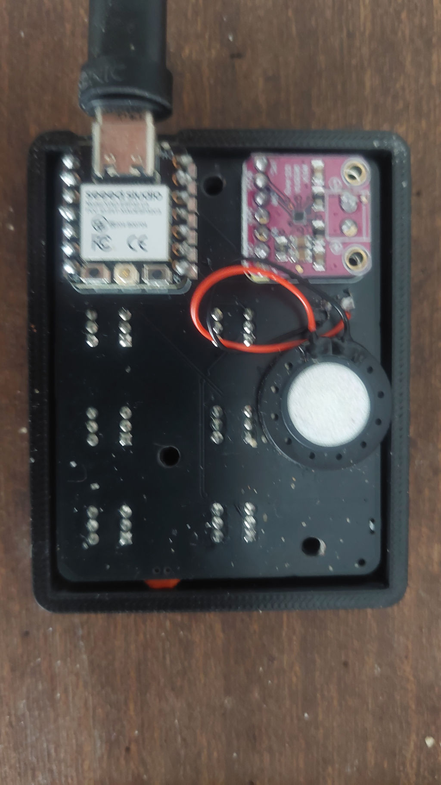
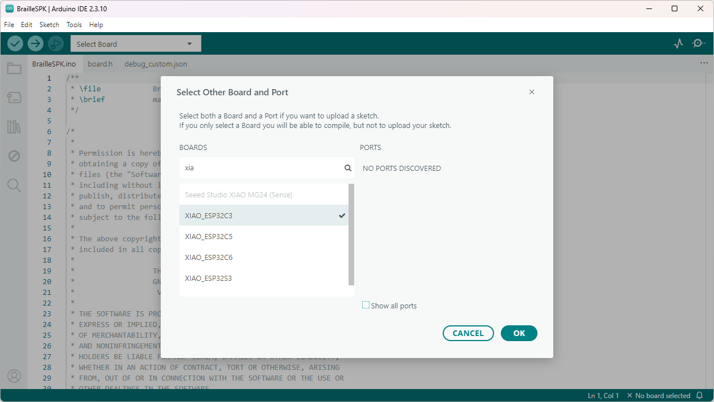
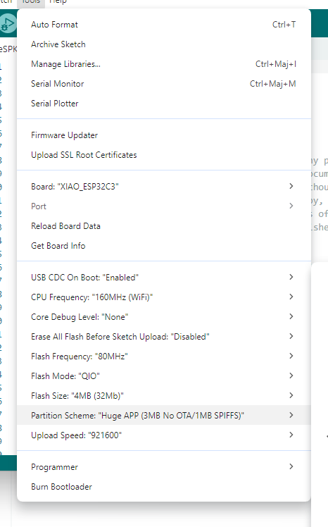
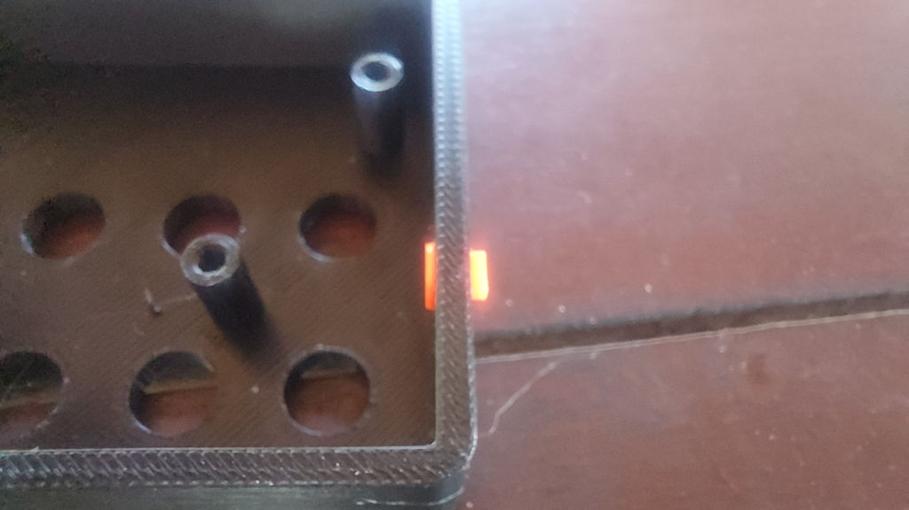
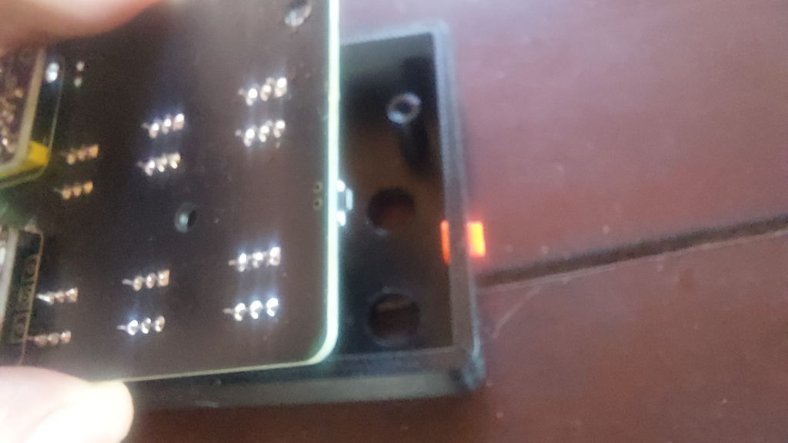
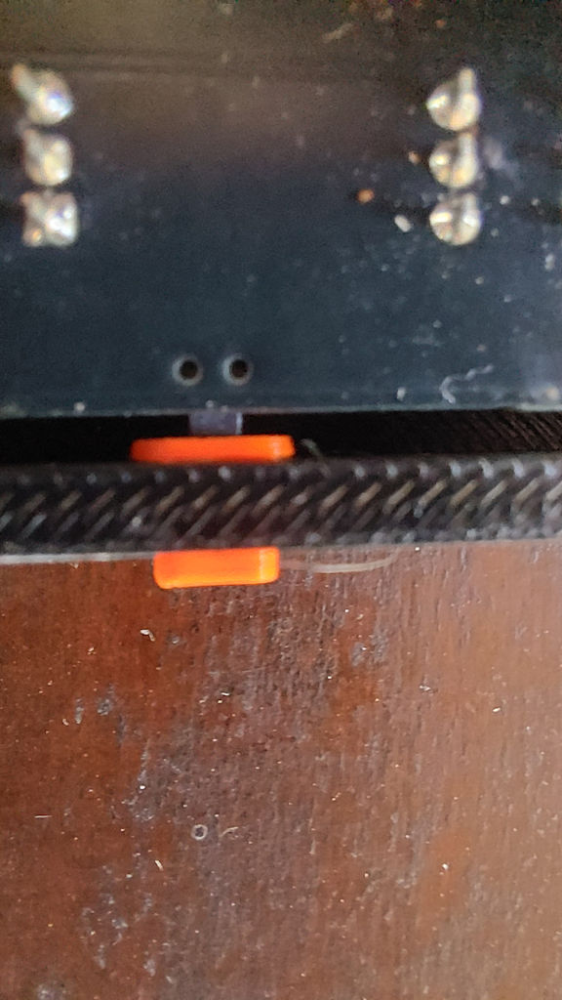

# BrailleSPK building manual

## Solder elements on PCB

### XIAO ESP32-C3 Welding

 - Take care of the USB connector orientation to place the MCU on board

### Audio Amp Welding

 - We use header pin to solder the audio output on the PCB. On audio amp the output connector use 3mm space. I've used 2 isolated pins cut from a standard 2.54 header.

### Soldering the speaker and glue it on PCB

- Solder the speaker wire on the BrailleSPK PCB. Respect the +/- polarity of the speaker.
- Glue the speaker on the PCB. Most 1510 speaker are equipped with adhesive tape.

### Upload the firmware

 - Open the firmware in 'firmware' directory with Arduino IDE version 2.3.x or later
 - Install ESP32 compiler if needed ([detail instructions available here](https://wiki.seeedstudio.com/Getting_Started_with_Arduino/))
 - Select **XIAO ESP32-C3** in menu **Tools/Board**.

 
 
 - Select "Huge partition scheme" in menu **Tools/Partition Scheme**.

 

 - Compile and upload the firmware

### Install Braille dots on BrailleSPK PCB

 - Gently insert 6 dots.stl on each keyboard switch of the BrailleSPK PCB.

### Install the action button

  - Insert the **bouton.stl** part in the hole on the top of the part **capot.stl**.

   

### Install the PCB

 - Gently put the PCB in place in **capot.stl** part, take care the action bouton stay in place.

 

 - Check that the action button is aligned with the PCB switch.

 

### Close the box

 - Put in place the part **fond.stl**. Use 3 M3-12 hex screw to secure the assembly.

## Enjoy !

 
